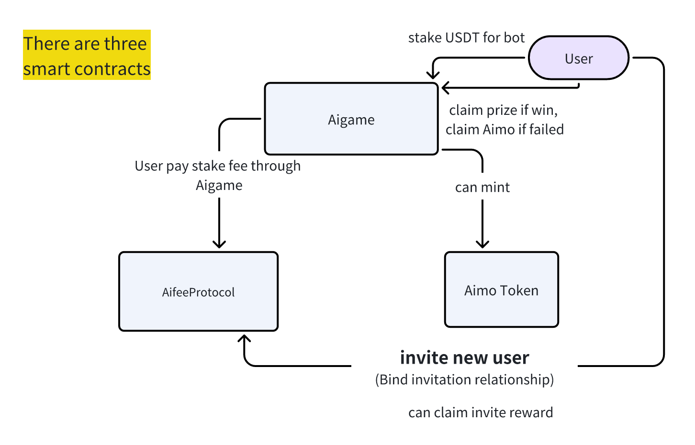

## Ai-game contracts


Ai-game is an decentralized game platform. User can stake USDT to their interested bots. Once the bot is win, users can divide the prize pool.

## Installation

- Install foundry

```
curl -L https://foundry.paradigm.xyz | bash
```

- Install dependencies

```
forge install
```

## Compile

```
forge compile
```

## deploy and verify

set environment variables

```
export PRIVATE_KEY=""
export RPC_URL=""
export ETHERSCAN_API_KEY=""
export VERIFIER_URL="https://api-sepolia.basescan.org/api"
```

deploy and verify on base sepolia testnet

```
forge script script/Deploy-base-sepolia-testnet.sol:DeployBaseSepoliaTestnet \
--chain base-goerli  --verifier-url $VERIFIER_URL \
--rpc-url $RPC_URL  --private-key $PRIVATE_KEY --broadcast --verify
```
